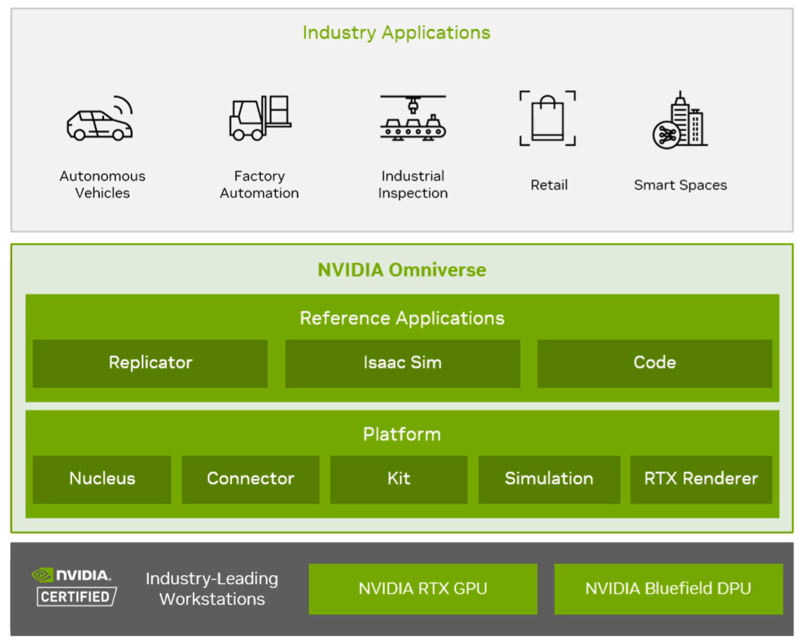

# Omniverse Synthetic Data Generation
In this repository, you will discover how to utilize NVIDIA Omniverse Isaac-sim `Replicator` along with Python for generating synthetic data and training the object detected model such as [Ultralytics YOLOv8](https://docs.ultralytics.com/).

Our task is to generate the **product sticker** to be placed outside the product's packaging. Given that each product requires three hours for assembly and packaging, accumulating a large dataset for training a detection model is time-consuming and inefficient, especially when the manually collected data may not be of high quality.

Utilizing `Synthetic data` as a substitute for real-world collected data offers a perfect solution to the aforementioned issues. It significantly reduces manual labor costs and saves considerable time. As illustrated below, the Omniverse supports RTX Rendering and a Simulation engine, enabling the simulation of real-world data. Moreover, through the use of the application layer above, it is possible to harness the Replicator and employ API code to randomly orchestrate and generate a diverse array of synthetic data.

  

Picture：High-level architecture of Isaac-sim & Replicator

We will talk about two part
1. [Replicator](./Replicator/)
2. [How to make real data.](./Real%20Data/)

### Notice 
--- 
**If you are new to Omniverse I `strongly` recommend reading the following contents to become more acquainted with this platform.**
* [Download Omniverse SDK](https://www.nvidia.com/zh-tw/omniverse/download/)
* [Omniverse Developer Guide Overview](https://docs.omniverse.nvidia.com/dev-guide/latest/index.html)
* [OpenUSD Overview](https://docs.omniverse.nvidia.com/usd/latest/index.html)
* [What Is Isaac Sim?](https://docs.omniverse.nvidia.com/isaacsim/latest/overview.html)
* [Youtube - Getting Started in NVIDIA Omniverse](https://youtube.com/playlist?list=PL4w6jm6S2lztLazLC7P0I4SnX3gxdL1Ad&si=53X1ctpgo9Yc0pEn)

### Upcoming Additions
---
* [NVIDIA TAO Toolkit](https://developer.nvidia.com/tao-toolkit)
* [Github - Replicator with TAO](https://github.com/NVIDIA-Omniverse/synthetic-data-examples/blob/main/end-to-end-workflows/palletjack_with_tao/cloud/training/cloud_train.ipynb)
### Resources
---
* [Replicator API](https://docs.omniverse.nvidia.com/py/replicator/1.10.10/source/extensions/omni.replicator.core/docs/API.html)
* [Replicator Docs](https://docs.omniverse.nvidia.com/extensions/latest/ext_replicator.html#theory-behind-training-with-synthetic-data)
* [Script Editor Docs](https://docs.omniverse.nvidia.com/extensions/latest/ext_script-editor.html)
* [Github - isaac-sim + vscode](https://github.com/Toni-SM/semu.misc.vscode)
* [Github - synthetic-data-examples](https://github.com/NVIDIA-Omniverse/synthetic-data-examples)
* [DLI - Synthetic Data Generation for Training Computer Vision Models](https://learn.nvidia.com/courses/course-detail?course_id=course-v1:DLI+S-OV-10+V1)
* [**GTC2024 - Empower Virtual Collaboration for Digital Twins Through Omniverse**](https://www.nvidia.com/en-us/on-demand/session/gtc24-s63282/)
* [Youtube - Generate Synthetic Data with Omniverse Replicator](https://www.youtube.com/watch?v=amVjqaABfU8&ab_channel=NVIDIAOmniverse)
* [Youtube - Deep Dive: Omniverse Replicator](https://www.youtube.com/watch?v=AGtIV5xgpYc&ab_channel=NVIDIAOmniverse)
* [Youtube - Randomizing a Scene with NVIDIA Omniverse Replicator](https://www.youtube.com/watch?v=5gBRbFqmZSE&ab_channel=NVIDIAOmniverse)
* [Youtube - Boosting Perception Model Training with Synthetic Data](https://www.youtube.com/watch?v=pR-vuZr7SiY&t=202s&ab_channel=SnorkelAI)
* [ultralytics/ultralytics YOLOv8](https://github.com/ultralytics/ultralytics)

### Hardware Utilized
* NVIDIA RTX4060Ti 16GB