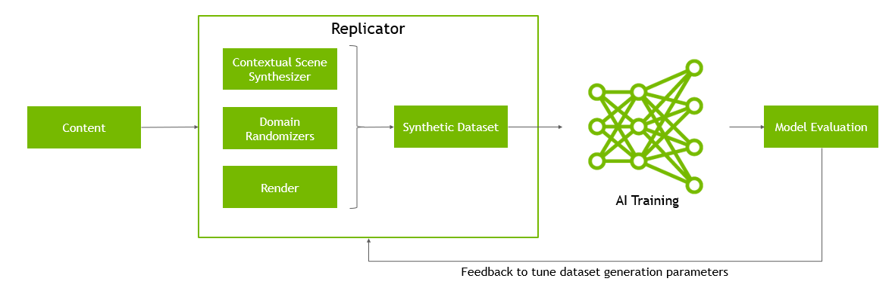

# Replicator
We can generate randomize data throught Replicator SDK, which is an open and modular framework. `Randomizer` + `Annotator` + `Writer` are available to address specific requirements for training AI models especially vision model, and can be used in either [Isaac-sim](https://docs.omniverse.nvidia.com/isaacsim/latest/overview.html) (recommanded) or [Omniverse code](https://docs.omniverse.nvidia.com/code/latest/index.html) (deprecated).  

We have three ways to use Omniverse Replicator
1. Python API
2. Replicator YAML
3. Action Graph

We recommand you use Python API first, which is the fastest way to leverage replicator in isaac-sim.

## Background
Deep Neural Network need large sets of annotated image datas, trained for the perception tasks such as detection, classification and segmentation.  
## Closing the Sim to Real Gap
* **Appearance Gap:**   
the `pixel level` between real and synthetic images, difference can cause by material, object complicated, rendering.
* **Content Gap:**  
Factors such as the quantity of objects present in a scene, the diversity in their types and placements, and other contextual elements contribute to the content gap between synthetic and real-world data.

  

Closing these gaps is vital to ensure that synthetic datasets accurately reflect real-world scenarios, enabling more effective training of AI models.
## Core Components

* Randomizers
* Annotators
* Writers

## Started
1. follow the [prerequest](./prerequest.md) to set up environment.  
2. Familiar with [replicator API](./omni.replicator.core/omni.replicator.core.md)

## Tutorial Arrange

| Level | Title | Description |
|----------|----------|----------|
| easy | Row 1, Col 2 | Row 1, Col 3 |
| easy | Row 2, Col 2 | Row 2, Col 3 |
| easy | Row 3, Col 2 | Row 3, Col 3 |
| easy | Row 4, Col 2 | Row 4, Col 3 |
| easy | Row 5, Col 2 | Row 5, Col 3 |

## References
* [NVIDIA Technical Blog - Replicator](https://developer.nvidia.com/blog/how-to-train-autonomous-mobile-robots-to-detect-warehouse-pallet-jacks-using-synthetic-data/)
* [Omni Replicator](https://docs.omniverse.nvidia.com/py/replicator/1.10.10/index.html#)
* [Extensions Docs](https://docs.omniverse.nvidia.com/extensions/latest/index.html)
* [Isaac Sim Replicator](https://docs.omniverse.nvidia.com/isaacsim/latest/replicator_tutorials/tutorial_replicator_getting_started.html)
* [Replicator Tutorial](https://docs.omniverse.nvidia.com/extensions/latest/ext_replicator.html#api-documentation)