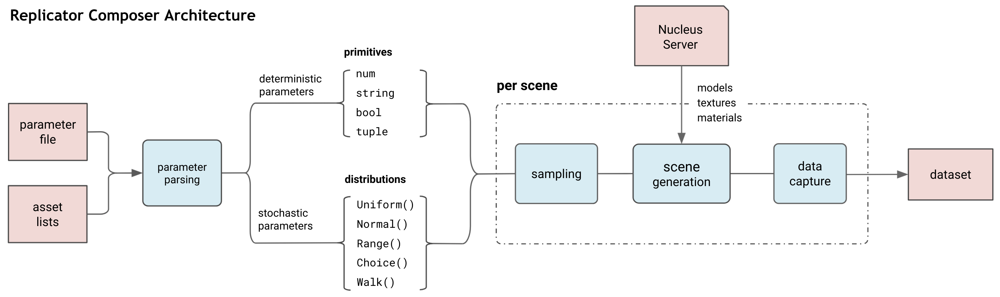

# omni.replicator.composer

use composer to use replicator from yaml file.

  

  

follow [replicator parameter lists](https://docs.omniverse.nvidia.com/isaacsim/latest/manual_replicator_composer_parameter_list.html#isaac-sim-app-manual-replicator-replicator_yaml-parameter-list)

## Reference
[Github - replicator_yaml](https://github.com/NVIDIA-Omniverse/synthetic-data-examples/tree/main/omni.replicator_yaml)