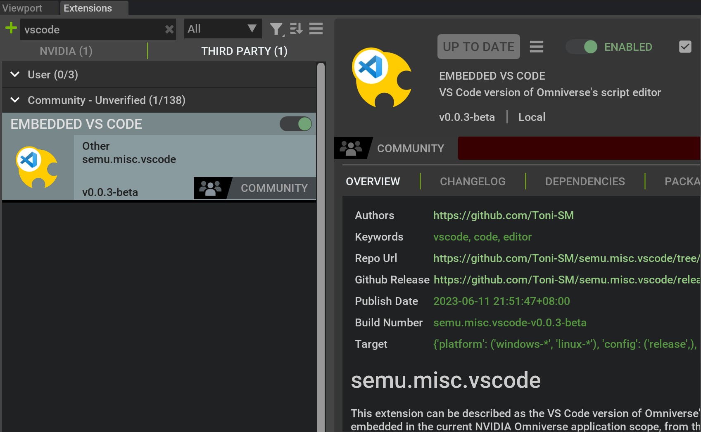

# Prerequest
### 1. Open Isaac sim
* Download Omniverse platform from [here](https://www.nvidia.com/zh-tw/omniverse/download/), you can choose either Linux or Windows version, and finished setting (you can follow [this video](https://www.youtube.com/watch?v=j4_-yush6pc&t=1s)).
* Go to **"Exchange"** page download `Isaac-sim` with version 2023.1.1.
* Click on first wich will have UI and terminal present.

  

### 2. Connect VScode
We can enhance our scripting convenience in Isaac Sim by connecting VScode and the Script Editor using the extension available on GitHub named [embedded-vscode-for-nvidia-omniverse](https://github.com/Toni-SM/semu.misc.vscode).  
1. Start Isaac Sim and navigate to `Window` -> `Extensions`. Search for `vscode`, which will display the following result:

  

Click the DISABLE button to toggle it, ensuring it changes to ENABLE, as shown in the image above.

2. Open VScode on the same device, go to the extensions page, and search for `omniverse`. You will find an extension called `Embedded VS Code for NVIDIA Omniverse`.

  

  

After downloading it, an Omniverse icon will appear in the left column. The connection is now complete. Both extensions will connect through the default port `8226`, allowing you to use the `omni.replicator.core` API in VScode and observe the results in Isaac Sim.

  

