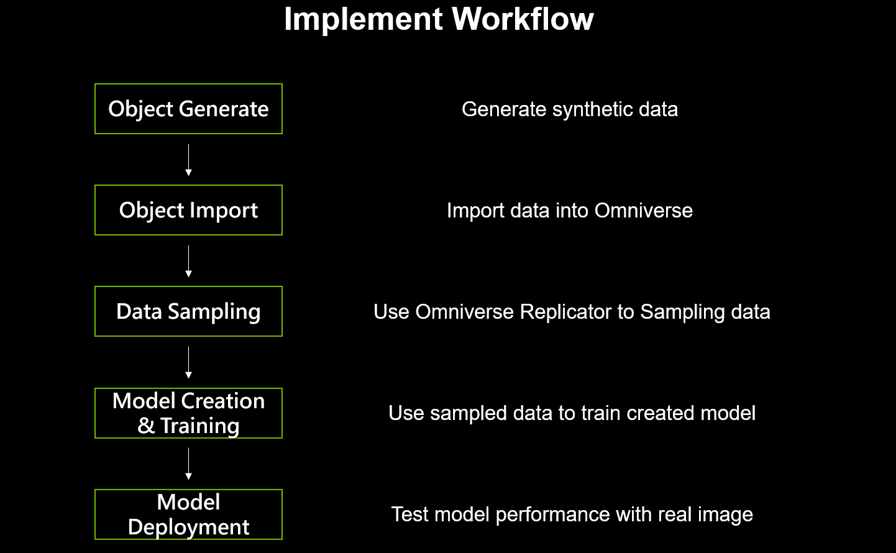
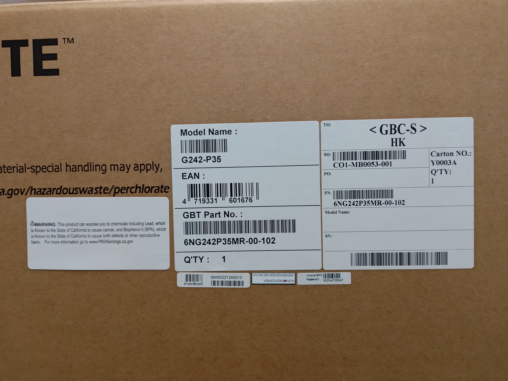
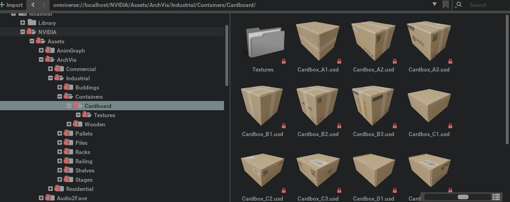
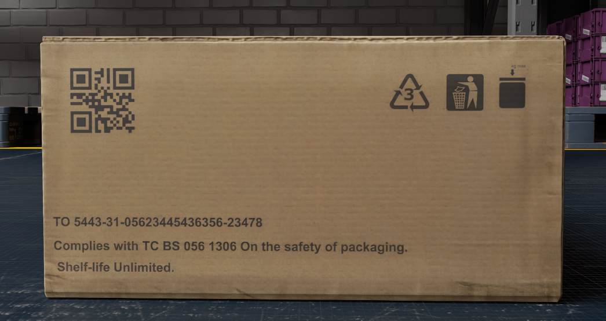
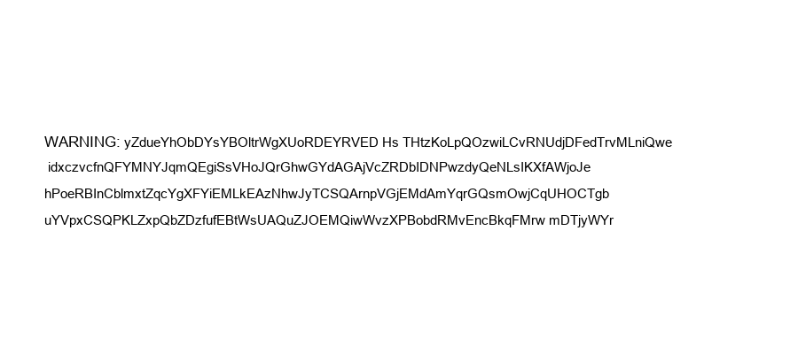
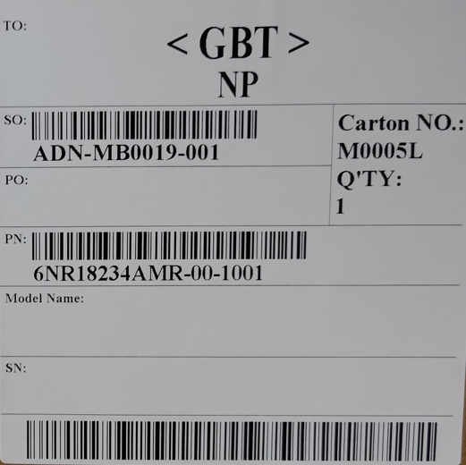

Table of content
---
- [1. Analyze Task](#1-analyze-task)
- [2. Add CardBox](#2-add-cardbox)
- [3. Generate Sticker](#3-generate-sticker)
  - [String Sticker](#string-sticker)
  - [Information Sticker](#information-sticker)
    - [Generate Barcode](#generate-barcode)
    - [Combine All Elements](#combine-all-elements)
- [4. Add Replicator](#4-add-replicator)
- [5. Add Annotator](#5-add-annotator)
- [6. Train YOLOv8 Model](#6-train-yolov8-model)
---
Workflow can see as below image.
<p align="center">
  
</p>

Clone the repo
```shell
git clone https://github.com/leekunhan/Omniverse_Synthetic_Generation.git
```
change directory to Tutorial
```shell
cd Tutorial
```
---
# 1. Analyze Task  
To simulate accurately, we analyze the golden data shown below to understand the necessary components of this task.   
<p align="center">
  
</p>
<p align="center">
Picture：Golden Data
</p>
From the analysis, we identify:

* Five different stickers with important product information.
* One sticker composed of multiple strings.

<p align="center">
  
</p>
<p align="center">
Picture：Target Elements
</p>
A critical aspect to note is the card box background.   
<br><br/>

# 2. Add CardBox  
Fortunately, there are some pre-build cardbox usd files can use in omniverse(Isaac-sim), so that we don't need to build by ourself.   

You can find various card box USDs at: 

```
omniverse://localhost/NVIDIA/Assets/ArchVis/Industrial/Containers/Cardboard/
```
<p align="center">
  
</p>

Select a card box type that suits your needs. I chose CardBox_C2.usd and added it to our scene.

<p align="center">
  
</p>

# 3. Generate Sticker
Please install all required packages first:

```shell
pip install -r requirements.txt
```
Let's start with generating a simple string sticker using the Pillow library.
## String Sticker
The code is available in [sitcker_generate](./sticker_generate/string_sticker_generater.ipynb)  
1. Generate a blank background.
2. Add random string to it.
3. Save the image.

<p align="center">
  
</p>

**Note: Details can be modified based on specific requirements.**

## Information Sticker
Let's analyze the most complex sticker to identify the necessary components.
<p align="center">
  
</p>

**Element:**
* Headers  (TO:, SO:, PO:, etc.)
* Information (GBT, Carton, etc.)
* Barcodes
* Barcode Information (ADN-MB0019-001, etc.)
* Vertical and horizontal lines

We can categorize these elements into those that can be created with Pillow and those that cannot. The barcode generation requires a separate process.   
### Generate Barcode
please find code in `/sticker_generate/barcode_generate_code39.ipynb` [click](./sticker_generate/barcode_generate_code39.ipynb)
1. Decide which barcode rules to use (change `barcode.get_barcode_class`)
2. Decide how many word appear on barcode (change `n`)
3. Set barcode name as barcode data (later need to appear on sticker)

**Note: Details can be modified based on specific requirements.**

### Combine All Elements

# 4. Add Replicator

# 5. Add Annotator

# 6. Train YOLOv8 Model